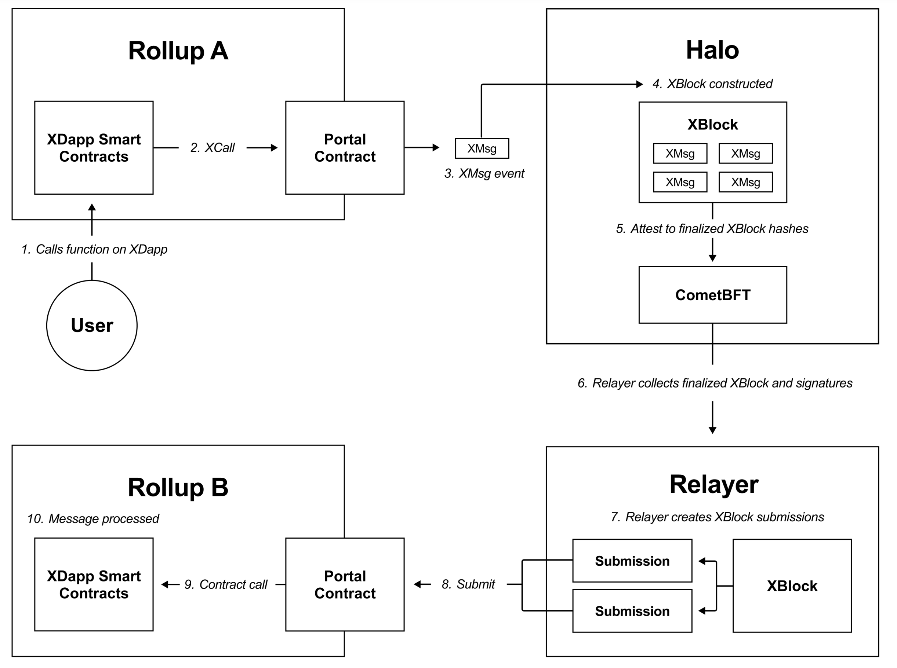
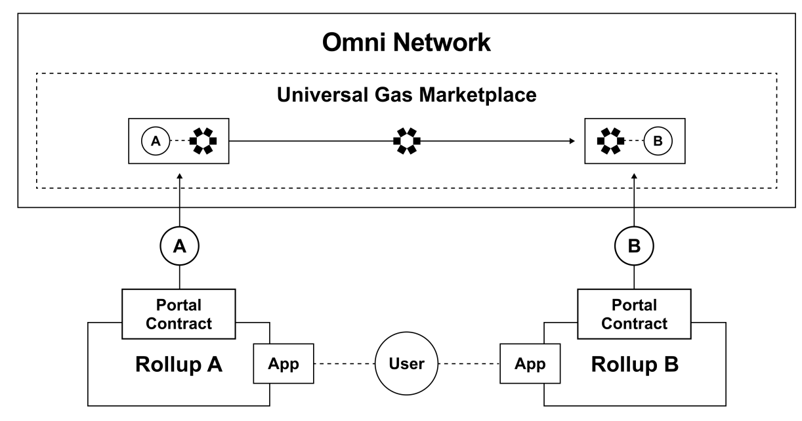
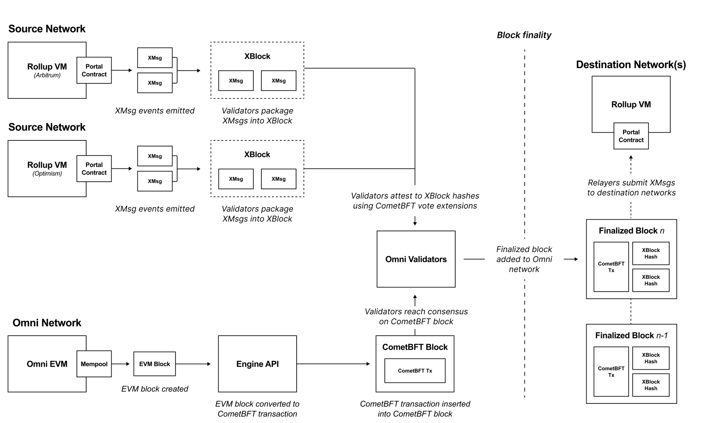

## Omini network

[git](https://github.com/omni-network/omni.git)  跨l2 资产转移协议，基于cosmos-sdk + CometBFT 实现

官网： https://omni.network/

Omini -network 架构概览


资产转移流程




值得一提的是omini 中所使用的gas（包括eth上）都是等比的omini-token




共识执行流程/ 区块产生流程




omini node architecture


Omini-project-tree

```shell
├── contracts: Solidity contracts, bindings, and testing for the Omni protocol.
│ ├── bindings: Go bindings for smart contracts.
│ ├── src: Solidity source files for the protocol's smart contracts.
│ └── test: Tests for smart contracts.
├── docs: Documentation resources, including images and diagrams.
├── explorer: Components for the Omni explorer.
│ ├── db: Database schemas and migrations.
│ ├── graphql: GraphQL API for the explorer.
│ └── ui: User interface for the explorer.
├── halo: The Halo instance, including application logic and attestation mechanisms.
│ ├── app: Application logic for Halo.
│ └── cmd: Command-line tools and utilities.
├── lib: Core libraries for various protocol functionalities.
│ ├── cchain: Consensus chain interaction utilities.
│ └── xchain: Cross-chain messaging and utilities.
├── relayer: Relayer service for cross-chain messages and transactions.
│ └── app: Application logic for the relayer service.
├── scripts: Utility scripts for development and operational tasks.
└── test: Testing suite for end-to-end, smoke, and utility testing.
```

从上述的目录结构来看，使用omini进行跨L2资产转移，首先要和部署在eth上 的 `omini-contracts` 进行交互产生`Xmsg`(omini 中自定义的跨链消息格式，类似于polkadot中的xcm)。在由Hlao模块收集为`XBlock` 经过`cometBFT` 的共识之后，确认资产转移的合法性，然后通过`relayer` 模块，告知 eth上的`omini-contract`  L2_A 完成了资产转移，并在L2_B上构建相应的资产。

换句话说跨链需要用到的模块：

* contracts
* halo
* relayer
* lib 则是负责整个omini共识层以及其他的核心组建。


## source code

### contract

OmniPortal.sol

```solidity
struct Msg {
        uint64 sourceChainId;
        uint64 destChainId;
        uint64 shardId;
        uint64 offset;
        address sender;
        address to;
        bytes data;
        uint64 gasLimit;
    }
    
struct Submission {
        bytes32 attestationRoot;
        uint64 validatorSetId;
        BlockHeader blockHeader;
        Msg[] msgs;
        bytes32[] proof;
        bool[] proofFlags;
        SigTuple[] signatures;
    }

event XReceipt(
        uint64 indexed sourceChainId,
        uint64 indexed shardId,
        uint64 indexed offset,
        uint256 gasUsed,
        address relayer,
        bool success,
        bytes error
    );
```

TODO


```go
type XMsg struct {
	Chainer

	ID            graphql.ID
	Block         XBlock
	To            common.Address
	Data          hexutil.Bytes
	DestChainID   hexutil.Big
	GasLimit      hexutil.Big
	DisplayID     string
	Offset        hexutil.Big
	Receipt       *XReceipt
	Sender        common.Address
	SourceChainID hexutil.Big
	Status        Status
	TxHash        common.Hash
}

type XReceipt struct {
	Chainer
	ID            graphql.ID
	GasUsed       hexutil.Big
	Success       bool
	Relayer       common.Address
	SourceChainID hexutil.Big
	DestChainID   hexutil.Big
	Offset        hexutil.Big
	TxHash        common.Hash
	Timestamp     graphql.Time
	RevertReason  *string
}

type XBlock struct {
	Chainer
	ID        graphql.ID
	ChainID   hexutil.Big
	Height    hexutil.Big
	Hash      common.Hash
	Messages  []XMsg
	Timestamp graphql.Time
}
```

TODO
